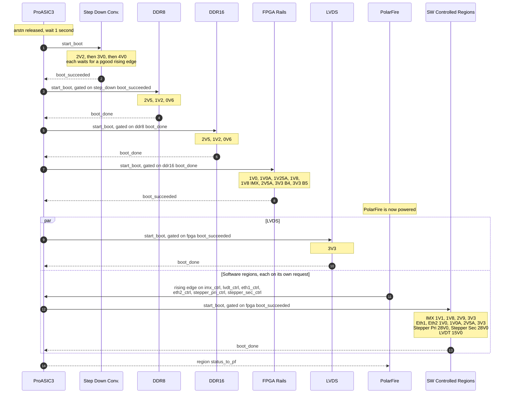
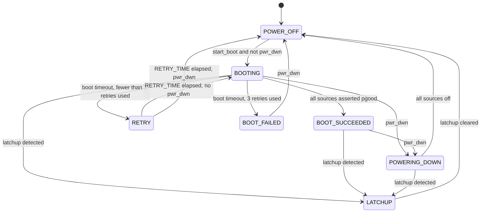
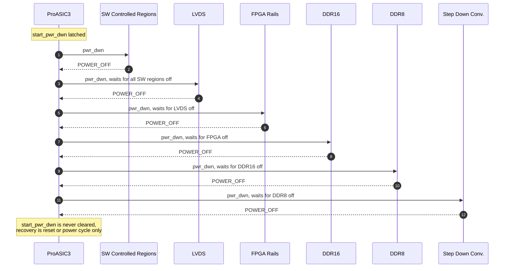
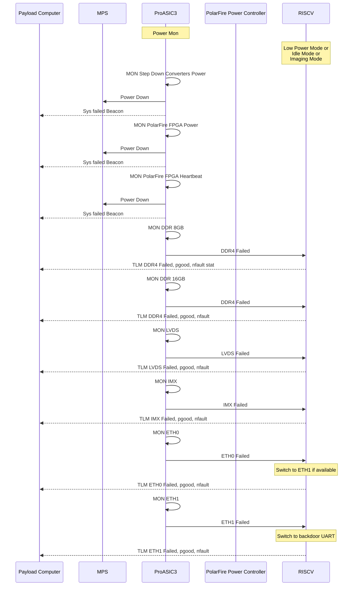

<!--
Migrated once from farsight-doc/04-section-sdd/pa3-housekeeper.tex at commit
81efafc, and maintained here since. This file is the source; do not regenerate
it from the LaTeX, which would discard the corrections made against the RTL and
move the line numbers that docs/requirements/pa3-housekeeper-findings.md cites.
Changes made here are not carried back to farsight-doc automatically.

The design is the source of truth. Where the LaTeX source disagreed with the
RTL, the RTL was followed. Note that the register and command sections of
farsight-doc are stale relative to the firmware and were deliberately not
migrated.
-->

### Housekeeper

Farsight Avionics Housekeeper consists of two FPGA chips for managing and monitoring
power status of the system. The ProASIC3 FPGA and PolarFire FPGA.

#### ProASIC3 FPGA Housekeeper Architecture

The ProASIC3 FPGA Housekeeper is responsible for controlling and monitoring
power to various subsystems on the Farsight Avionics board. It manages 33 power
sources organized into 11 power regions, each with dedicated state machines for
sequencing and fault detection.

**Power Source Interface**

Each power source on the board provides the following signals:

- **Enable** (output, active high): Controlled by the FPGA to turn the power source on or off.
- **PGOOD** (input, active high): Indicates the power source has stabilized and is operating correctly.
- **NFAULT** (input, active low): Present on some sources to indicate a fault condition.

All PGOOD and NFAULT inputs pass through a 5 us glitch filter to reject
transient noise before being processed by the housekeeper logic.

| **Boot** | **Power Region** | **Power Source** | **Fault?** | **Critical** | **SW Ctrl** | **Mode When First Enabled** | **Nominal Boot Time** |
| --- | --- | --- | --- | --- | --- | --- | --- |
| 1 | Step Down Conv. | 2V2 | Yes | Yes | No | - | 2.6 ms |
| 2 | Step Down Conv. | 3V0 | Yes | Yes | No | - | 2.0 ms |
| 3 | Step Down Conv. | 4V0 | Yes | Yes | No | - | 2.0 ms |
| 4 | DDR8 | 2V5 | Yes | No | No | - | 0.704 ms |
| 5 | DDR8 | 1V2 | Yes | No | No | - | 0.52 ms |
| 6 | DDR8 | 0V6 | No | No | No | - | 0.40 ms |
| 7 | DDR16 | 2V5 | Yes | No | No | - | 1.23 ms |
| 8 | DDR16 | 1V2 | Yes | No | No | - | 0.91 ms |
| 9 | DDR16 | 0V6 | No | No | No | - | 0.40 ms |
| 10 | FPGA | 1V0 | Yes | Yes | No | BOOT_MODE | 0.64 ms |
| 11 | FPGA | 1V0A | No | Yes | No | BOOT_MODE | 2.3 ms |
| 12 | FPGA | 1V25A | No | Yes | No | BOOT_MODE | 2.3 ms |
| 13 | FPGA | 1V8 | No | Yes | No | BOOT_MODE | 2.3 ms |
| 14 | FPGA | 1V8 IMX | No | Yes | No | BOOT_MODE | 2.3 ms |
| 15 | FPGA | 2V5A | No | Yes | No | BOOT_MODE | 2.3 ms |
| 16 | FPGA | 3V3 B4 | No | Yes | No | BOOT_MODE | 2.3 ms |
| 17 | FPGA | 3V3 B5 | No | Yes | No | BOOT_MODE | 2.3 ms |
| 1 | LVDS | 3V3 | No | No | Yes | - | 2.3 ms |
| 1 | Eth1 | 1V0 | No | No | Yes | - | 2.3 ms |
| 2 | Eth1 | 1V0A | No | No | Yes | - | 2.3 ms |
| 3 | Eth1 | 2V5A | No | No | Yes | - | 2.3 ms |
| 4 | Eth1 | 3V3 | No | No | Yes | - | 2.3 ms |
| 1 | Eth2 | 1V0 | No | No | Yes | - | 2.3 ms |
| 2 | Eth2 | 1V0A | No | No | Yes | - | 2.3 ms |
| 3 | Eth2 | 2V5A | No | No | Yes | - | 2.3 ms |
| 4 | Eth2 | 3V3 | No | No | Yes | - | 2.3 ms |
| 1 | Stepper Primary Motor | 28V0 | Yes | No | Yes | Only when in use | N/A |
| 1 | Stepper Secondary Motor | 28V0 | Yes | No | Yes | Only when in use | N/A |
| 1 | LVDT | 15V0 | No | No | Yes | - | 2.3 ms |
| 1 | IMX | 1V1 | Yes | No | Yes | IDLE_MODE | 1.22 ms |
| 2 | IMX | 1V8 | No | No | Yes | IDLE_MODE | 2.3 ms |
| 3 | IMX | 2V9 | No | No | Yes | IDLE_MODE | 0.45 ms |
| 4 | IMX | 3V3 | No | No | Yes | IDLE_MODE | 5.1 ms |

_Table: PA3 Housekeeper Region Information_

**Power Region Types**

Power regions are classified into two categories:

- **Hardware-Controlled Regions:** Five regions that boot automatically at power-up in a fixed sequence: the step-down converters, DDR8, DDR16, the PolarFire FPGA rails and LVDS. "Critical" means different things for the two kinds of failure. A boot failure in the step-down or FPGA region triggers a controlled system shutdown; a boot failure in DDR8, DDR16 or LVDS is reported and the system keeps running. A latchup in any of the five holds every region off until reset or power cycle.
- **Software-Controlled Regions:** Six regions controlled by the PolarFire firmware once the FPGA region has booted: the IMX camera sensor, Eth1, Eth2, the primary and secondary stepper motors, and LVDT. Each region can be independently enabled or disabled via its control input.

**Boot Sequence**

The power-up sequence proceeds as follows:

1. Hardware-controlled regions boot sequentially in a predefined order, each waiting for the previous region to finish booting before starting.
2. If a power source fails to assert PGOOD within twice the expected boot time, the region is disabled for 200 ms and re-attempted.
3. Each region is allowed up to four boot attempts before being declared inoperable.
4. Once the FPGA region has booted, software-controlled regions can be enabled by the PolarFire firmware, whether or not LVDS has finished.

**Power-Up Sequence**



_Figure: ProASIC3 power-up sequence_

Two of the four hardware controlled handoffs require the previous region to
succeed and two do not. `ddr8_start_boot` and `lvds_start_boot` are gated on
`boot_succeeded`, so a step down converter or FPGA boot failure stops the chain.
`ddr16_start_boot` and `fpga_start_boot` are gated on `boot_done`, which is
asserted in `BOOT_FAILED` as well as `BOOT_SUCCEEDED`, so the chain continues
past a DDR boot failure. That matches the Critical column of the region table
above: the step down converters and the FPGA rails are critical, the DDR
regions are not.

Each region runs its own state machine, in `src/pwr_region_sm.sv`:



_Figure: Power region state machine_

`NUM_RETRIES` is 3, so a region makes four boot attempts in total before
entering `BOOT_FAILED`. Within a region, sources are enabled one at a time in
order and each waits for a pgood rising edge before the next is enabled.
A region powered down during its retry hold finishes the hold before going to
`POWER_OFF`, so a failed rail is never re-enabled sooner than `RETRY_TIME`,
and a region withdrawn and requested again during the hold continues its
existing attempt count rather than starting a new one.

**Power-Down Sequence**

`start_pwr_dwn` in `src/health_monitor.sv` is a single global signal. It is
set-only and is never cleared except by `rstn`, and it feeds the power-down
input of every region, software controlled and hardware controlled alike. A
step down converter or FPGA boot failure therefore powers down the entire
payload, not just the region that failed:

```
if(!eps_efuse_pgood || fpga_boot_failed || step_down_boot_failed)
    start_pwr_dwn <= '1;
```

`eps_efuse_pgood` is an external input. DDR8, DDR16, LVDS and the software
controlled regions do not appear in this condition, so a boot failure in those
regions is reported as telemetry and the system keeps running.

Once asserted, the regions are torn down in reverse boot order. Each stage
waits until every source of the stage before it is in `POWER_OFF` (the
region's `srcs_off` output), so a region still booting, or still powering
down, is waited for; a region that never started is passed at once. A region
told to power down part-way through its boot goes through `POWERING_DOWN`
like a booted one, its sources in reverse.



_Figure: ProASIC3 power-down sequence_

The step down converters boot first and shut down last, which they must, since
they feed everything downstream. Within a region the sources are also powered
down in reverse order, from the last enabled to the first.

**Power Monitoring and Fault Response**



_Figure: ProASIC3 power monitoring and fault response_

This figure is titled "Farsight Hardware Powerup Sequence Diagram" in the
farsight-doc source. It is retitled here because it contains no power-up
actions: every message is a monitor step or a failure response, its own
lifeline note reads "Power Mon", and the ordering does not follow the boot
order, since the FPGA rails appear second where they boot fourth. What the
ordering does follow is the Critical column of the region table: the two
critical regions are shown taking the system down, and every non critical
region is shown reporting telemetry only. The power-up sequence it was named
for is documented above.

Four details in it do not match the RTL. They are recorded rather than
corrected, because correcting them would mean guessing at intent rather than
reading it from the design:

- **PolarFire heartbeat monitoring is not implemented.** `heartbeat` in
  `src/top.sv` is an output only; the ProASIC3 emits a heartbeat and has no
  heartbeat input from the PolarFire. Its only inputs from the PolarFire are
  the software control enables and the RS-422 pass-through. The third Power
  Down branch has no counterpart in the design.
- **The Ethernet regions are named ETH1 and ETH2 in the design**, not ETH0 and
  ETH1. See `eth1_ctrl` and `eth2_ctrl` in `src/top.sv`, and the region table
  above, which already uses Eth1 and Eth2.
- **DDR8, DDR16 and LVDS are shown as telemetry only.** That is correct for a
  boot failure, but a latchup in any of them asserts `critical_latchup`, which
  is a harder response than the staged shutdown above. See Latchup Detection
  and Handling below.
- **The PolarFire Power Controller lifeline carries no messages.** It is
  retained for fidelity with the source figure.

**Latchup Detection and Handling**

A latchup condition is detected when:

- A PGOOD signal goes low after the power source was successfully booted, or
- An NFAULT signal goes low after the source was enabled.

Both are judged on the 5 us filtered inputs. Only the 11 sources marked in
the Fault? column have an NFAULT input; the rest are detected by PGOOD alone.
Step-down 4V0 ignores its NFAULT while it boots (`IGNORE_LATCHUP_ON_BOOT`).

The response to a latchup depends on the region type:

- **Hardware-controlled region latchup:** Causes immediate and permanent shutdown of all power sources until the next power cycle.
- **Software-controlled region latchup:** Causes immediate shutdown of only that specific power region. The region can be re-enabled only by a low-then-high transition of its control input.
- **IMX latchup, additionally:** A latchup in any of the four IMX sources asserts both `imx_nshort_1v1` and `imx_nshort_1v8`, which crowbar the 1V1 and 1V8 rails to ground. Each is released when its supply's enable is next asserted.

**Controlled Shutdown**

A controlled shutdown is initiated when:

- The EPS eFuse PGOOD signal has been low for more than 5 us, or
- A critical power region fails to boot after all retry attempts.

During controlled shutdown:

1. All software-controlled regions are disabled simultaneously.
2. Hardware-controlled regions are then disabled one by one in reverse boot order.
3. Each power source within a region is disabled sequentially, in reverse of
   its boot order. The next source begins once the one after it is off: its
   filtered PGOOD has fallen, or 2.294 ms have passed since its own power-down
   began, whichever is first (`src/pwr_src_bootseq.sv`, `POWERING_DOWN`). The
   timeout is not only a fallback: 18 of the 33 sources are LT3065 LDOs, whose
   PGOOD is released, and reads high, once they are disabled, so for those the
   timeout is the only thing that spaces the shutdown. A source still booting
   when it is told to power down has no PGOOD to lose, so it is given its full
   2.294 ms before the source below it begins. With every region up, a
   controlled shutdown takes about 32 ms from the eFuse PGOOD falling to the
   last step-down enable.

**Failure Reporting**

During normal operation, the ProASIC3 operates in pass-through mode, routing
UART traffic directly between the PolarFire and the payload bus. If a critical
failure occurs and the PolarFire is powered down, the ProASIC3 takes control
of the UART and broadcasts a failure status message approximately once per
second. The message format is shown in the table below.

| **Byte** | **Region** | **b7** | **b6** | **b5** | **b4** | **b3** | **b2** | **b1** | **b0** |
| --- | --- | --- | --- | --- | --- | --- | --- | --- | --- |
| 0 | Header | 0xDE |  |  |  |  |  |  |  |
| 1 | Header | 0xAD |  |  |  |  |  |  |  |
| 2 | Header | 0xBE |  |  |  |  |  |  |  |
| 3 | Header | 0xEF |  |  |  |  |  |  |  |
| 4 | FPGA pgood | 3V3_B5 | 3V3_B4 | 2V5A | 1V8_IMX | 1V8 | 1V25A | 1V0A | 1V0 |
| 5 | FPGA | 0 | 0 | 0 | 0 | 0 | 0 | 0 | 1V0_nfault |
| 6 | LVDS | 0 | 0 | 0 | 0 | 0 | 0 | 0 | 3V3_pgood |
| 7 | DDR16 | 0 | 0 | 0 | 0V6_pgood | 1V2_pgood | 2V5_pgood | 1V2_nfault | 2V5_nfault |
| 8 | DDR8 | 0 | 0 | 0 | 0V6_pgood | 1V2_pgood | 2V5_pgood | 1V2_nfault | 2V5_nfault |
| 9 | Step Down | 0 | 0 | 4V0_pgood | 3V0_pgood | 2V2_pgood | 4V0_nfault | 3V0_nfault | 2V2_nfault |
| 10 | Trailer | 0xBA |  |  |  |  |  |  |  |
| 11 | Trailer | 0xDD |  |  |  |  |  |  |  |
| 12 | Trailer | 0xFE |  |  |  |  |  |  |  |
| 13 | Trailer | 0xED |  |  |  |  |  |  |  |

_Table: Housekeeper UART Failure Message Format_
